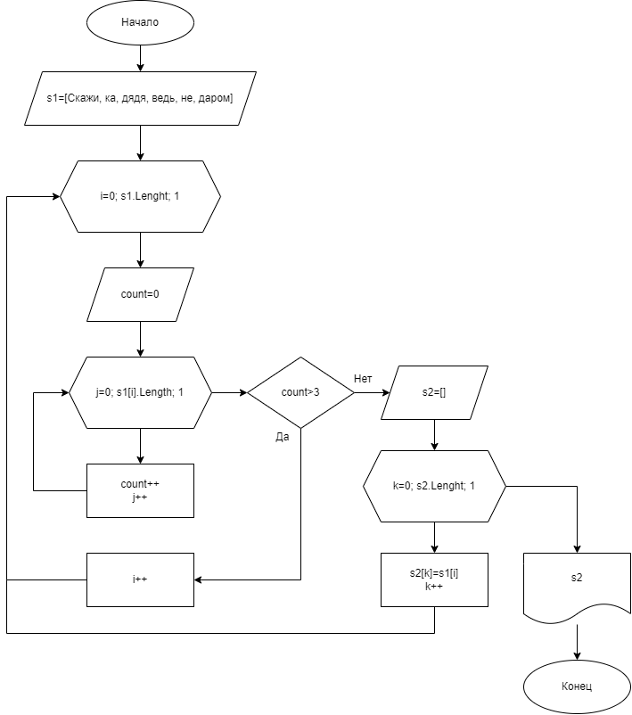

# Контрольная работа

**Задача:** Написать программу, которая из имеющегося массива строк формирует новый массив из строк, длина которых меньше, либо равна 3 символам. Первоначальный массив можно ввести с клавиатуры, либо задать на старте выполнения алгоритма. При решении не рекомендуется пользоваться коллекциями, лучше обойтись исключительно массивами.

**Решение:**

                *Блок-схема решения задачи*

1. Инициализируем массив строк: ***s1 = [скажи, ка, дядя, ведь, не, даром]***

2. Открываем цикл перебора элементов массива ***s1[]***

3. Устанавливаем значение счетчика ***count = 0***

4. Открываем цикл перебора количества символов в каждом элементе массива ***s1[i]***

5. Подсчитываем количество символов в каждом элементе массива ***s1[i]*** и записываем его в счетвик ***count***

6. Производим условное сравнение значения счетчика ***count*** и отбираем необходимые нам строки с количством символов меньшем либо равным трём

7. Инициализируем новый массив ***s2[]*** и запускаем цикл записи значений в него

8. Записываем в текущее значение нового массива значения, прошедшие наше условие

9. По завершении всех циклов выводим наш новый массив ***s2[]***