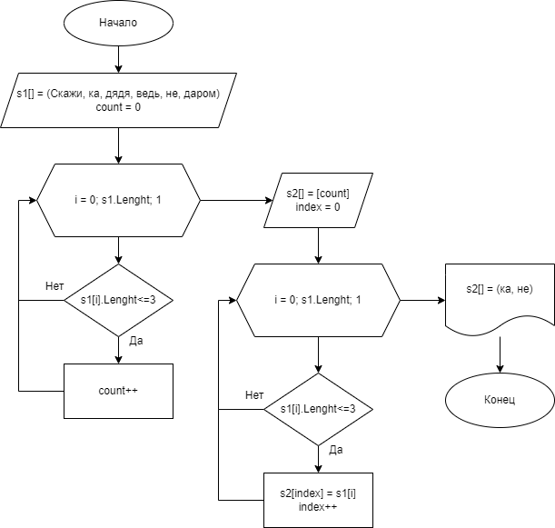

# Контрольная работа

**Задача:** Написать программу, которая из имеющегося массива строк формирует новый массив из строк, длина которых меньше, либо равна 3 символам. Первоначальный массив можно ввести с клавиатуры, либо задать на старте выполнения алгоритма. При решении не рекомендуется пользоваться коллекциями, лучше обойтись исключительно массивами.

**Решение:**

                    *Блок-схема решения задачи*

1. Инициализируем массив строк: ***s1 = [скажи, ка, дядя, ведь, не, даром]*** 

__*ВНИМАНИЕ!!! Первоначальный ввод массива производиться с клавиатуры, элементы массива через пробел__

2. Устанавливаем значение счетчика ***count = 0***

3. Открываем цикл перебора элементов массива ***s1[]***

4. Увеличиваем значение счетчика на один каждый раз когда выполняется условие ***s1[i].Lenght<=3***

5. Инициализируем массив ***s2[]*** с длиной массива равной значению ***count***

6. Устанавливаем значение ***index = 0*** для нумерации индекса массива ***s2[]*** 

7. Открываем цикл перебора элементов массива ***s1[]***

8. При выполнении условия ***s1[i].Lenght<=3*** *(длина строки меньше или равна 3 символам)* записываем в значение ***s2[index]*** текущее значение ***s1[i]*** и увеличиваем инкремент на единицу ***(index++)***

9. По завершении всех циклов выводим наш новый массив: ***s2[] = (ка, не)***